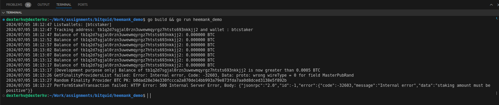

# Babylon Staking Script

Author : Heemank Verma (@heemankv) \
Time Range : 2nd July - 5th July 2024 \
Language : `Go-lang`

### Aim

To create a Go Lang script that monitors Bitcoin deposits into a specific address and stakes the deposited Bitcoin against Babylon Testnet 4 by selecting a random finality provider. [Read More](TaskDescription.pdf)

---

### Points to remember

1. Babylon Testnet 4 is completed, resulting in staking probably failing. [See this](images/Testnet_4_Ended.png)
2. Babylon's Discord channel is at full capacity, hence can't join, resulting in improper access of sBTC [See this](images/Discord_Full.png)
3. No Signet Faucet is reliable. [See this](images/Faucet_Not_Working.png)
4. Testnet-4 has had major improvements over Testnet-3.

---

### Pre Requsities

0. `Linux system` is prefered, all the external docs are written in respect to linux.
1. `go` installed in the system.
2. `bitcoind` should be installed, configured and running. [Installation Guide](https://github.com/babylonchain/btc-staker?tab=readme-ov-file#2-setting-up-a-bitcoin-node)
3. `stakerd` should be installed, configured and running. [Installation Guide](https://github.com/babylonchain/btc-staker?tab=readme-ov-file#2-setting-up-a-bitcoin-node)

---

### Current Status of Script

1. It extract local wallet's label.
2. It assumes the first receiving address as the tracking address of the wallet.
3. It fetches user's final balance every 5 seconds, if it becomes greater than threshold it breaks loop.
4. It fetches the Finality Providers from `stakerd`, upon failure it the same fetches from `staker-api`
5. It constructs the Staking Arguments and calls `stakerd`'s `stake` RPC method.
6. (Staking fails due to various reasons) It logs the staking result.

---

### Demo



---

### Stepwise process

#### Command to launch `bitcoind` Server

```cmd
./bin/bitcoind -deprecatedrpc=accounts -signet -server -txindex -rpcport=38332 -rpcuser=dexterhv -rpcpassword=verma -rpcallowip=0.0.0.0/0
```

#### Command to launch `stakerd` Server

```cmd
./stakerd
```

#### Creating bitcoind RPC client

1. We use [github.com/btcsuite/btcd/rpcclient](https://github.com/btcsuite/btcd/tree/master/rpcclient) to create a RPC client and connect to `bitcoind` server.

   ```go
   func CreateClient(host string, user string, pass string) (*rpcclient.Client, error){
     client, err := rpcclient.New(&rpcclient.ConnConfig{
       HTTPPostMode: true,
       DisableTLS:   true,
       Host:         host,
       User:         user,
       Pass:         pass,
     }, nil)

     return client,err
   }
   ```

#### Checking Available Wallets

1. We use [rpcClient RawRequest](https://pkg.go.dev/github.com/btcsuite/btcd@v0.24.2/rpcclient#Client.RawRequest) to make a `listWallet` transaction and extract available wallet labels.

   ```go
   params := []json.RawMessage{}
     var result []string

     err = btcService.CreateRawRequest(client, config.bitcoindListWalletsMethodName, params, &result)
     if err != nil {
       log.Fatalf("Error calling RPC method: %v", err)
     } else if !(len(result) > 0) {
       log.Fatalf("Error No Wallet Found: %v", result)
       return
     }

     log.Printf("Listwallets: %+v\n", result)
   ```

#### Extracting Wallet's first receiver address

1. We assume that we have to track user's first receiver address unless mentioned otherwise.

   ```go
     walletToTrack := result[0]
     params = []json.RawMessage{json.RawMessage(fmt.Sprintf(`"%s"`, walletToTrack))}
     var result2 map[string]btcService.AddressInfo

     err = btcService.CreateRawRequest(client, config.bitcoindListAddressesByLabelMethodName, params, &result2)
     if err != nil {
       log.Fatalf("Error calling RPC method getaddressesbylabel : %v", err)
     }

     var addressToTrack string
     for address := range result2 {
       addressToTrack = address
       break
     }
   ```

#### Looping for Balance checks

1. we loop till overall balance exceeds threshold required by babylon's Staking Script.
2. We use rpcClient's GetBalance method to get user's latest confirmed balance.
3. `FOR DEV PURPOSE ONLY` We escape loop after 6 iterations.

   ```go
   count := 0
   for {
     balanceResult, err := client.GetBalance("*")
     if err != nil {
       log.Fatalf("Error getting balance: %v", err)
     }

     balanceFloat, err := parseBalance(balanceResult.String())
     if err != nil {
       log.Fatalf("Error parsing balance: %v", err)
     }

     log.Printf("Balance of %s: %f BTC\n", addressToTrack, balanceFloat)

     if balanceFloat > config.stakingMinThreshold || count > 5 {
       break
     }

     time.Sleep(5 * time.Second)
     count++
   }
   ```

#### Extracting Finality Provider's btcKey - 1

1. We call `stakerd`'s mentioned rpc method `babylon_finality_providers` to get latest finality provider.

2. This call will fail, reasons stated in `Problems Faced` Section.

   ```go
   func GetFinalityProvidersList(url string) (string, error) {
     resp, err := http.Get(url + "babylon_finality_providers")
     if err != nil {
       return "", err
     }
     defer resp.Body.Close()

     if resp.StatusCode != http.StatusOK {
       if resp.StatusCode == http.StatusInternalServerError {
         body, readErr := io.ReadAll(resp.Body)
         if readErr != nil {
           return "", readErr
         }

         var errorResponse FinalityProviderErrorResponse
         jsonErr := json.Unmarshal(body, &errorResponse)
         if jsonErr != nil {
           return "", jsonErr
         }

         return "", fmt.Errorf(fmt.Sprintf("Error: %s, Code: %d, Data: %s", errorResponse.Error.Message, errorResponse.Error.Code, errorResponse.Error.Data))
       }
       return "", fmt.Errorf(fmt.Sprintf("HTTP Error: %s", resp.Status))
     }
   }
   ```

#### Extracting Finality Provider's btcKey - 2

1. We call babylon provided `staker-api`'s RPC method to get the list of finality providers.
2. Finality Provider's list is received and a finality provider at random is chosen and it's `fpKey` is returned.

   ```go
   func StakingApiGetFinalityProvidersList(url string) (*Response, error) {
     resp, err := http.Get(url + "finality-providers")
     if err != nil {
       return nil, fmt.Errorf("failed to make GET request: %v", err)
     }
     defer resp.Body.Close()

     if resp.StatusCode != http.StatusOK {
       return nil, fmt.Errorf("unexpected status code: %d", resp.StatusCode)
     }

     body, err := io.ReadAll(resp.Body)
     if err != nil {
       return nil, fmt.Errorf("failed to read response body: %v", err)
     }

     var response Response
     err = json.Unmarshal(body, &response)
     if err != nil {
       return nil, fmt.Errorf("failed to unmarshal response: %v", err)
     }

     return &response, nil
   }

   // selects a random finality provider and returns its btc_pk
   func GetRandomFinalityProviderBtcPk(providers []FinalityProvider) (string, error) {
     if len(providers) == 0 {
       return "", fmt.Errorf("no finality providers available")
     }
     randomIndex := rand.Intn(len(providers))
     return providers[randomIndex].BtcPk, nil
   }
   ```

#### Performing Staking Transaction

1. We call `stakerd`'s RPC method `stake` to do the transaction.
2. Marshelling and Unmarshalling of json req,response is also handled.
3. Call made is similar to fetching finality providers from `stakerd`.
   ```go
     url := "http://127.0.0.1:15812/stake"
     requestBody := StakingRequest{
         StakerAddress:     stakerAddr,
         StakingAmount:     stakingAmt,
         FpBtcPks:          fpBtcPk,
         StakingTimeBlocks: stakingTime,
     }
   ```

#### Running the script

- if all the configs are done right and adhearing to all that is provided here, the script should give the same output as presented in the Demo section.

Run Command : Just like any other go script:

```bash
 go build && go run heemank_demo
```

---

### Problems Faced :

1. Had to use RawRequest since btcclient is [not up to date](https://github.com/btcsuite/btcd/issues/1546) and it doesn't have impl of features like 'listwallets'.
2. `stakerd`'s getFinalityProviders function fails.
3. `stakerd`'s stake function fails.

- MY UNDERSTANDING : `stakerd` failure is majorly in performing any call is related to testnet-4 not having an RPC link, there is no publicly available config of [bbn-test-4](https://github.com/babylonchain/networks/tree/main/bbn-test-4) as there is of [bnn-test-3](https://github.com/babylonchain/networks/tree/main/bbn-test-3). Hence invalid staker.config and bad rpc method responses.

4. Raw stake transaction with 'bitcoind' fails

- MY UNDERSTANDING : [This article](https://github.com/babylonchain/babylon/blob/dev/docs/transaction-impl-spec.md#building-op_retrun-and-staking-output-implementation) describes how a Raw Staking Transaction can be made using using `bitcoind` and then executed, but the functions that are needed specially `BuildV0IdentifiableStakingOutputsAndTx` are not exported from the package,
  - Only way to get `BuildV0IdentifiableStakingOutputsAndTx`'s code is to access it through `BuildStakingInfo` function, but still can't be used because it's supporting packages have build issues. [See This](https://github.com/bitquid-labs/heemank_demo/blob/bcb9af1a3198446cd3f42755b40c178309ddec7e/rpc_bitcoind.go#L52)
  - All the other functions needed to do this transaction are available but since the above function is lacking this execution can't be completed.
